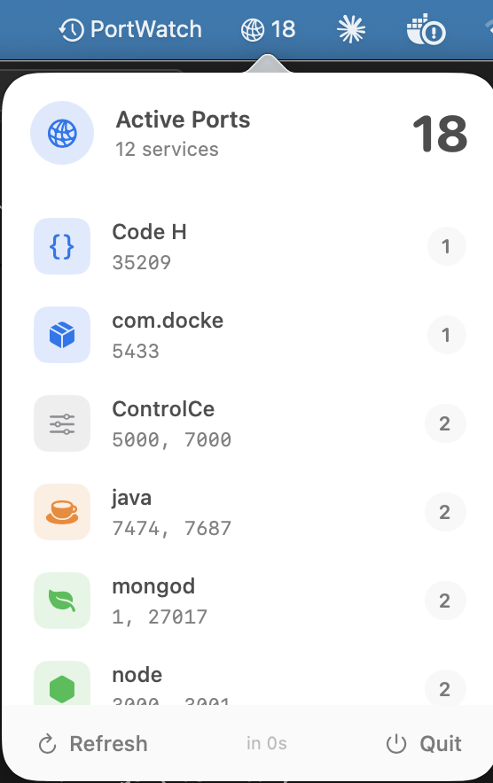

# PortWatch

A macOS menu bar app that displays applications listening on TCP ports.

## Features

- Shows count of apps with open ports in the menu bar
- Groups ports by application
- Color-coded icons by service type (Node.js, Python, Redis, etc.)
- Auto-refreshes every 5 seconds
- Click any app to see its ports

## Requirements

- macOS 14.0 (Sonoma) or later
- XcodeGen (`brew install xcodegen`)
- App Sandbox must be disabled (uses `lsof` command)

## Installation

### With Claude

Open this repo in Claude Code and ask:

> Install this app on my Mac

Claude will check your system, build the app, and install it to Applications.

### Manual

1. Install XcodeGen: `brew install xcodegen`
2. Generate project: `xcodegen generate`
3. Build: `xcodebuild -scheme PortWatch -configuration Release build`
4. Copy to Applications: `cp -r ~/Library/Developer/Xcode/DerivedData/PortWatch-*/Build/Products/Release/PortWatch.app /Applications/`
5. Launch: `open /Applications/PortWatch.app`

## How It Works

Uses `lsof -iTCP -sTCP:LISTEN` to detect applications with open TCP ports, parses the output, and displays them in a clean menu bar interface.

## License

MIT
